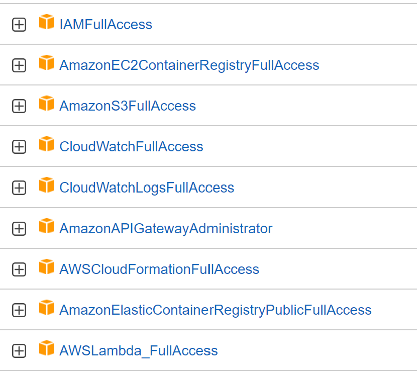

# 1. Deploy CIFAR10 Model on AWS Lambda and share link to your Lambda

endpoint created: POST - https://3iehv17hj6.execute-api.ap-south-1.amazonaws.com/dev/inference

functions:  cifar: serverless-cifar-dev-cifar

ARN:  arn:aws:lambda:ap-south-1:258326714772:function:serverless-cifar-dev-cifar

## 1.1. - Install the packages

```
curl -sL https://deb.nodesource.com/setup_14.x | sudo -E bash -
sudo apt install nodejs
sudo npm i -g serverless
```

## 1.2. - Get the Code for serverless from this folder.
## 1.3. - Create the docker and push the image to ECR on a private repository.

    My ECR Repository [URI:](258326714772.dkr.ecr.ap-south-1.amazonaws.com/cifar10_serverless) 

## 1.4. - Add permissions to IAM Role



## 1.5. Run the command to deploy your code
```
serverless deploy
```


## 1.6. Some Errors Faced:
```
CREATE_FAILED: IamRoleLambdaExecution (AWS::IAM::Role)
API: iam:CreateRole User: arn:aws:sts::258326714772:assumed-role/TestSession5EC2S3Access/i-0a6509e740e929efd is not authorized to perform: iam:CreateRole on resource: arn:aws:iam::258326714772:role/serverless-cifar-dev-ap-south-1-lambdaRole because no identity-based policy allows the iam:CreateRole action
```
 Added IAMFullAccess to the EC2 IAM role.

```
CREATE_FAILED: CifarLambdaFunction (AWS::Lambda::Function)
Resource handler returned message: "'MemorySize' value failed to satisfy constraint: Member must have value less than or equal to 3008 (Service: Lambda, Status Code: 400, Request ID: f23c4c31-8577-41ed-b402-c11a355cf8c1)" (RequestToken: 45626d5b-a0af-54bb-22e5-89a1b08f1142, HandlerErrorCode: InvalidRequest)
```


# 2. Deploy Frontend on Vercel and share link to your deployment

Frontend code repository: https://github.com/MittalNeha/emlo-serverless

Deployment URL: https://emlo-serverless.vercel.app/

<br>

<br>

## Useful Tips
1. Check the memory of your instance
```
grep MemTotal /proc/meminfo
```
2. curl command to test serverless deployement [curl](../../../../../C:/Work/EMLO/SchoolOfAI_EMLO/9.%20Deployement%20on%20Accelerators%20and%20Serverless/cmd.txt)
